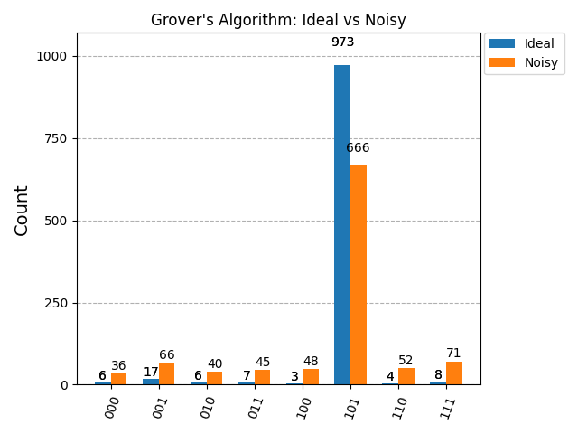
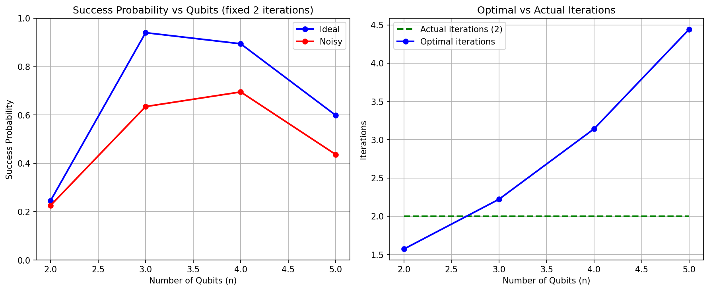

# Grover's Search Algorithm — Qiskit Implementation

A ground-up implementation of Grover's quantum search algorithm in Qiskit, featuring a parameterized oracle, depolarizing noise simulation, and scaling analysis across 2-5 qubits.

## Background

Grover's algorithm solves **unstructured search**: given N unsorted items and one marked solution, find it. Classical search requires O(N) operations on average. Grover's achieves this in O(√N) — a quadratic speedup — by exploiting quantum amplitude amplification.

The algorithm has three stages:
1. **Superposition** — initialize all N states simultaneously via Hadamard gates
2. **Oracle** — flip the phase of the target state from +1 to -1, marking it without measuring it
3. **Diffusion** — reflect all amplitudes around their mean, amplifying the marked state

Repeating stages 2 and 3 for `k = (π/4)√N` iterations maximizes the probability of measuring the correct answer. More iterations is not better — the probability is sinusoidal and overshooting reduces it.

## Implementation

### Parameterized Oracle
The oracle is fully generalized — any n-bit target state can be marked without modifying the circuit logic. For each qubit where the target has a `0`, an X gate flips it before the multi-controlled Toffoli (MCX) fires, then flips it back. This means the same oracle function works for any search target across any number of qubits.

### Noise Modeling
The circuit was tested under a depolarizing noise model simulating realistic hardware conditions:
- Single-qubit gates (H, X): 1% error rate
- Two-qubit gates (CX): 5% error rate  
- Three-qubit gates (CCX): 5% error rate

This mirrors the error profile of current IBM superconducting hardware, where two-qubit gate fidelity is the dominant bottleneck.

### Scaling Analysis
The algorithm was benchmarked across n=2 to n=5 qubits with a fixed iteration count of 2, comparing ideal vs noisy performance. The optimal iteration count grows as `(π/4)√(2ⁿ)`, so fixing iterations at 2 creates a predictable performance curve — optimal at n=3, undershooting at n=4 and n=5, and overshooting at n=2.

## Results

### Ideal vs Noisy (n=3, target=|101⟩, 2 iterations)
| | Success Probability |
|---|---|
| Ideal simulator | 94.9% |
| Noisy simulator | 71.9% |

Noise introduced a ~23 percentage point drop, with leaked probability distributed roughly uniformly across all 7 wrong states — consistent with depolarizing noise behavior.

### Scaling Analysis (fixed 2 iterations)
| Qubits (n) | States (N) | Optimal Iterations | Ideal Probability | Noisy Probability |
|---|---|---|---|---|
| 2 | 4 | 1.6 | 23.8% | 25.8% |
| 3 | 8 | 2.2 | 94.9% | 71.6% |
| 4 | 16 | 3.1 | 89.3% | 77.2% |
| 5 | 32 | 4.4 | 60.3% | 48.7% |




> **Note on n=2:** The noisy simulator (25.8%) marginally outperforms the ideal (23.8%) — 
> this is not a real advantage. The ideal probability at n=2 with k=2 iterations is 
> mathematically exactly 25% (the algorithm overshoots its own peak and collapses back to 
> the uniform distribution baseline). Depolarizing noise independently pushes results toward 
> the same uniform baseline. The two degradation mechanisms converge on the same value, and 
> the remaining 2 percentage point gap is within one standard deviation of sampling variance 
> (σ ≈ 1.35% for 1024 shots). Running more shots would eliminate the gap entirely.

Key observations:
- n=2 underperforms because 2 iterations **overshoots** the optimal of 1.6 — the algorithm runs past its own peak
- n=3 peaks because 2 iterations is nearly optimal
- n=4 and n=5 degrade because 2 iterations increasingly **undershoots** the optimal count
- Noise compounds the undershoot at higher qubit counts, dropping n=5 below 50%

## How to Run

### Requirements
- Python 3.8+
- IBM Quantum account (free) at [quantum.ibm.com](https://quantum.ibm.com)

### Installation
```bash
git clone https://github.com/thegreatlol/grover-qiskit.git
cd grover-qiskit
pip install qiskit qiskit-aer qiskit-ibm-runtime matplotlib numpy
```

### Run
```bash
python3 grover.py
```

### Output
- Terminal: measurement counts for ideal and noisy runs + scaling analysis per qubit count
- `grover_results.png` — histogram comparing ideal vs noisy results for n=3
- `grover_scaling.png` — success probability and optimal iteration count across n=2 to n=5

### Changing the target state
In `grover.py`, modify this line in the main block:
```python
target = '101'  # any n-bit binary string
```
The oracle and diffusion operator adjust automatically.